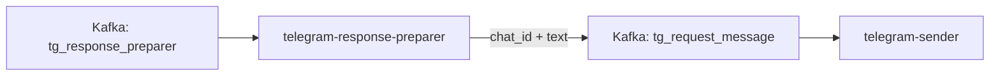
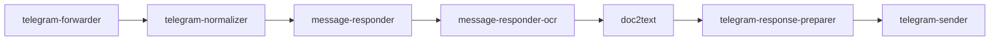

## О приложении

telegram-response-preparer конвертирует `NormalizedResponse` из Kafka в минимальный `SendMessageRequest`, понятный Telegram‑отправителю. Сервис не знает о Telegram API — он лишь перекладывает поля и публикует JSON в отдельный топик.

## Роль приложения в архитектуре проекта

Он связывает общий конвейер с конкретным отправителем:


message-responder(-ocr) пишет ответы в суффиксный топик, а preparer превращает их в лёгкий формат (`chat_id`, `text`) и передаёт в `telegram-sender`, который уже вызывает Bot API.

## Локальный запуск

1. Убедитесь, что Go ≥ 1.24 установлен и есть доступ к Kafka‑кластеру. telegram-sender должен быть подписан на тот же выходной топик, чтобы увидеть сообщения.
2. Экспортируйте переменные `KAFKA_*`:
   - `KAFKA_BOOTSTRAP_SERVERS_VALUE` — брокеры.
   - `KAFKA_TOPIC_NAME_TG_RESPONSE_PREPARER` — топик, куда upstream записывает `NormalizedResponse`.
   - `KAFKA_GROUP_ID_TG_RESPONSE_PREPARER` — consumer group для этого сервиса.
   - `KAFKA_TOPIC_NAME_TG_REQUEST_MESSAGE` — выходной топик для telegram-sender.
   - `KAFKA_CLIENT_ID_TG_RESPONSE_PREPARER`, опционально `KAFKA_SASL_USERNAME`/`KAFKA_SASL_PASSWORD`.
3. Запустите приложение:
   ```bash
   go run ./cmd/tg-response-preparer
   ```
   или через Docker.
4. Проверьте, что сообщения с `chat_id` и `text` появляются в `KAFKA_TOPIC_NAME_TG_REQUEST_MESSAGE` и считываются `telegram-sender`.
